Most of the repositories here are coursework, study notes, and small projects. I'm currently learning digital logic, Verilog, computer architecture, GPU systems, AI infrastructure, and spiking neural networks.

**我想睡觉 😴**

## Currently learning

- Digital logic, **Verilog**, and computer architecture
- **GPU architecture**, parallel computing, and **AI infrastructure**
- **Spiking neural networks** and neuromorphic hardware
- Embedded development with **Arduino** and **STM32**

## Tools

<picture>
  <source media="(prefers-color-scheme: dark)" srcset="https://skillicons.dev/icons?i=c%2Ccpp%2Cpython%2Cpytorch%2Clinux%2Cgit%2Cvscode%2Carduino%2Ccmake%2Clatex&theme=dark" />
  <source media="(prefers-color-scheme: light)" srcset="https://skillicons.dev/icons?i=c%2Ccpp%2Cpython%2Cpytorch%2Clinux%2Cgit%2Cvscode%2Carduino%2Ccmake%2Clatex&theme=light" />
  
</picture>

## GitHub activity

<picture>
  <source media="(prefers-color-scheme: dark)" srcset="https://github-readme-activity-graph.vercel.app/graph?username=sjy0630&bg_color=0d1117&color=a78bfa&line=a855f7&point=ffffff&area=true&hide_border=true" />
  <source media="(prefers-color-scheme: light)" srcset="https://github-readme-activity-graph.vercel.app/graph?username=sjy0630&bg_color=ffffff&color=6d28d9&line=8b5cf6&point=4c1d95&area=true&hide_border=true" />
  
</picture>

 

<picture>
  <source media="(prefers-color-scheme: dark)" srcset="https://raw.githubusercontent.com/sjy0630/sjy0630/output/github-contribution-grid-snake-dark.svg" />
  <source media="(prefers-color-scheme: light)" srcset="https://raw.githubusercontent.com/sjy0630/sjy0630/output/github-contribution-grid-snake.svg" />
  
</picture>

